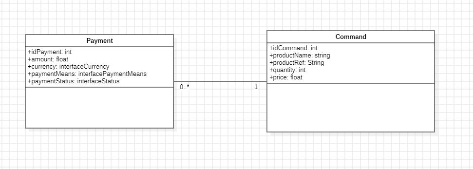
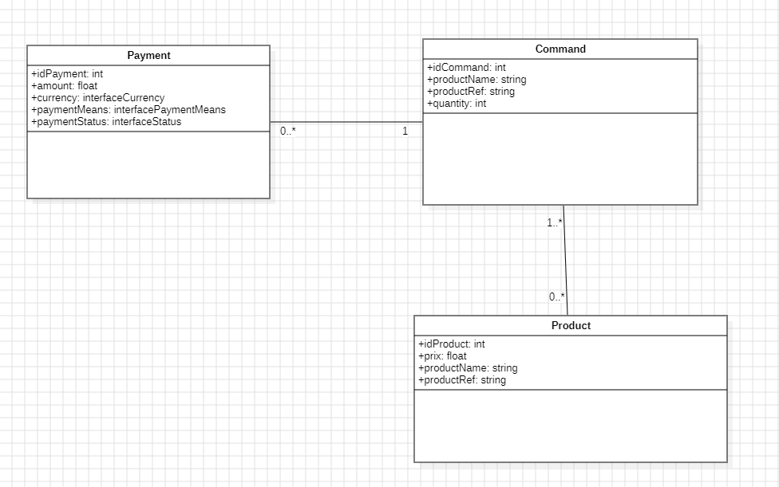

# Project of payment API

The project is a new version of paymentExercice : https://github.com/GeoffreyHPro/paymentExercice
the old version i started works with h2 database and jpa.
But i dont finish it to learn and implement exercie in webflux.

This new version works with postgresql and webflux. 

This project allows to create, read, and modify a payment. 

Here the database in API



# 👩‍💻 Technologies

| Back - Spring Boot | version (works) | 
| --- | --- |
| java | 22 |
| maven| 3.9.6 |
| Docker| 26.1.1 |

# 🛠 Project and funtionnalities

✅ Read a command

✅ Read a payment

✅ create a command

✅ modify a command

✅ create a payment

✅ modify a payment

# ⚡️ Standard Execution

Start postgresql database

```bash
docker-compose up
```

Destroy database

```bash
docker-compose down -v
```

Start API REST

```bash
mvn spring-boot:run
```

URL of Swagger: http://localhost:8080/swagger-ui.html

# Future functionalities and perspective

Idea for future database

